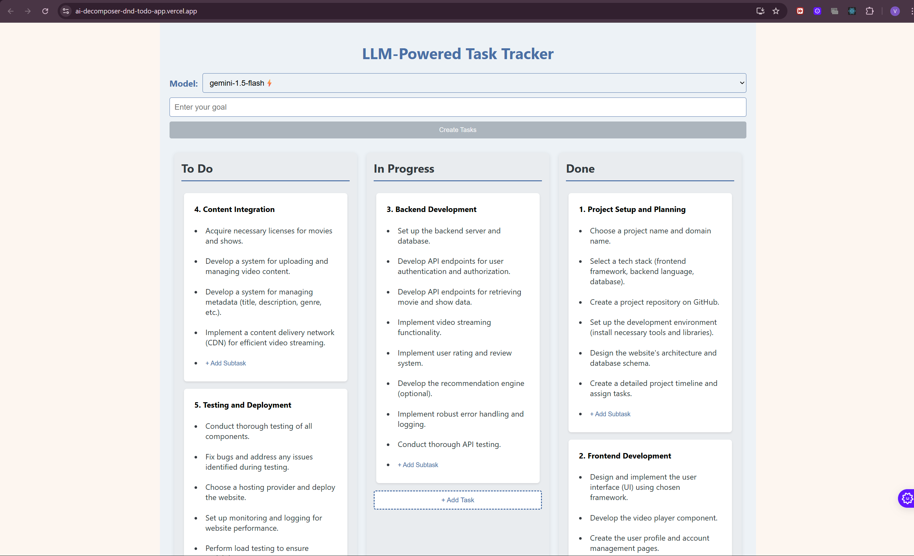

<<<<<<< HEAD
# AI_Decomposer_DND_TODO_App# 🧠 LLM-Powered Task Decomposition App

 <!-- Replace with a real screenshot -->
=======
# 🧠 LLM-Powered Task Decomposition App


>>>>>>> a77eb86eb4a922f2dcfccaa7a257a6665b422b2a

A full-stack AI productivity tool that uses powerful LLMs to **break down complex goals into actionable tasks**, all presented in a sleek, drag-and-drop Kanban interface.

---

## ✨ Features

- 🤖 **Multi-Model LLM Support** – Integrate and query:
  - Gemini (Google)
  - OpenAI (GPT)
  - Anthropic Claude
  - Hyperbolic API

- 🧩 **Goal-to-Task Conversion** – Automatically convert user goals into structured subtasks and step-by-step action plans

- 📝 **Editable Tasks** – Click to edit task titles and subtasks inline

- 🧲 **Drag-and-Drop UI** – Move tasks across `To Do`, `In Progress`, and `Done` with ease

- 📊 **Kanban-Style Visualization** – Clear, visual organization of all your tasks

<<<<<<< HEAD
- 📱 **Responsive Design** – Works seamlessly on both desktop and mobile
=======
>>>>>>> a77eb86eb4a922f2dcfccaa7a257a6665b422b2a

---

## 🛠 Tech Stack

### 🖥️ Frontend
<<<<<<< HEAD
- ⚛️ React.js + TypeScript
=======
- ⚛️ React.js
>>>>>>> a77eb86eb4a922f2dcfccaa7a257a6665b422b2a
- 📦 DnD Kit – Drag-and-drop functionality
- 🔔 React Toastify – Toast notifications
- 📡 Axios – API requests
- 🎨 CSS Modules – Scoped styling

### 🧪 Backend
- 🚀 FastAPI (Python)
- 🤖 Google Generative AI, OpenAI, Anthropic Claude, Hyperbolic APIs
- 🌐 Hosted on **Render**
- ⚙️ Uvicorn – ASGI server

---

## 🚀 Hosted Version

- 🌍 **Frontend**: Deployed on **[Vercel](https://vercel.com/vaibhav-singhs-projects-c5ab9c36/ai-decomposer-dnd-todo-app)**
- 🧠 **Backend**: Powered by FastAPI and hosted on **Render**

<<<<<<< HEAD
> 🔗 **Try it Live**: [AI Decomposer DnD ToDo App →](https://vercel.com/vaibhav-singhs-projects-c5ab9c36/ai-decomposer-dnd-todo-app)
=======
> 🔗 **Try it Live**: [AI Decomposer DnD ToDo App →](https://ai-decomposer-dnd-todo-app.vercel.app/)
>>>>>>> a77eb86eb4a922f2dcfccaa7a257a6665b422b2a

---

## 🧰 Installation

<<<<<<< HEAD
### 1. Backend Setup

```bash
git clone https://github.com/yourusername/llm-task-decomposer.git
cd llm-task-decomposer/backend
pip install -r requirements.txt
uvicorn app:app --reload
=======
## 🔙 1. Backend Setup
### - Clone the repository
```
gh repo clone VVISHUS/AI_Decomposer_DND_TODO_App
cd AI_Decomposer_DND_TODO_App/backend
```
### - Create and activate a virtual environment (optional but recommended)
```
python -m venv venv
source venv/bin/activate  # On Windows use `venv\Scripts\activate`
```
### - Install Python dependencies
```
pip install -r requirements.txt
```
### - Run the FastAPI backend server
```
uvicorn app:app --port 5000 --reload
```
## 🚀 The backend will be accessible at:
```
http://localhost:5000/decompose/
```
## 🎨 2. Frontend Setup
### - Navigate to the frontend project directory
```
cd ../task-tracker
```
### - Install frontend dependencies
```
npm install
```
### - Update the API URL in the frontend
### - Open src/App.js and set the API URL like this:
```
const apiUrl = "http://localhost:5000/decompose/";
```
### - Start the React development server
```
npm run dev  # or `npm start` if using plain React
```
## 🧠 Make sure your FastAPI backend is running before using the frontend!

---

## 🚀 Future Improvements
- Add authentication (e.g., Google OAuth)
- Export/import task board as JSON or CSV
- Backend Connectivity to save the progress
- Task deadline and priority support
- Support for more LLMs and configurable prompts

---

## 📄 License
This project is open-source and available under the MIT License.

---

## 📢 Feedback & Contributions
If you encounter bugs or have suggestions, feel free to open an issue or submit a pull request on GitHub.
Happy Hacking! 🚀

>>>>>>> a77eb86eb4a922f2dcfccaa7a257a6665b422b2a
