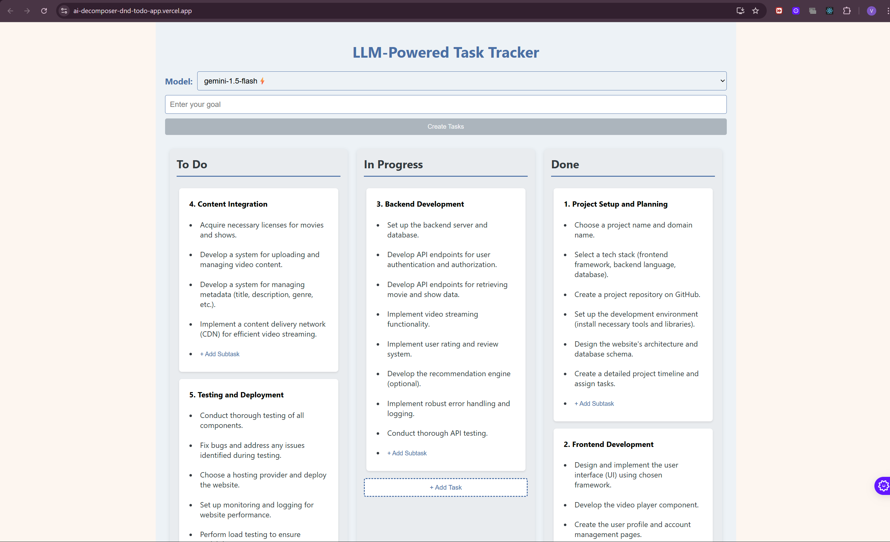

# 🧠 LLM-Powered Task Decomposition App



A full-stack AI productivity tool that uses powerful LLMs to **break down complex goals into actionable tasks**, all presented in a sleek, drag-and-drop Kanban interface.

---

## ✨ Features

- 🤖 **Multi-Model LLM Support** – Integrate and query:
  - Gemini (Google)
  - OpenAI (GPT)
  - Anthropic Claude
  - Hyperbolic API

- 🧩 **Goal-to-Task Conversion** – Automatically convert user goals into structured subtasks and step-by-step action plans

- 📝 **Editable Tasks** – Click to edit task titles and subtasks inline

- 🧲 **Drag-and-Drop UI** – Move tasks across `To Do`, `In Progress`, and `Done` with ease

- 📊 **Kanban-Style Visualization** – Clear, visual organization of all your tasks

- 📱 **Responsive Design** – Works seamlessly on both desktop and mobile

---

## 🛠 Tech Stack

### 🖥️ Frontend
- ⚛️ React.js
- 📦 DnD Kit – Drag-and-drop functionality
- 🔔 React Toastify – Toast notifications
- 📡 Axios – API requests
- 🎨 CSS Modules – Scoped styling

### 🧪 Backend
- 🚀 FastAPI (Python)
- 🤖 Google Generative AI, OpenAI, Anthropic Claude, Hyperbolic APIs
- 🌐 Hosted on **Render**
- ⚙️ Uvicorn – ASGI server

---

## 🚀 Hosted Version

- 🌍 **Frontend**: Deployed on **[Vercel](https://vercel.com/vaibhav-singhs-projects-c5ab9c36/ai-decomposer-dnd-todo-app)**
- 🧠 **Backend**: Powered by FastAPI and hosted on **Render**

> 🔗 **Try it Live**: [AI Decomposer DnD ToDo App →](https://vercel.com/vaibhav-singhs-projects-c5ab9c36/ai-decomposer-dnd-todo-app)

---

## 🧰 Installation

### 1. Backend Setup

```bash
git 
cd llm-task-decomposer/backend
pip install -r requirements.txt
uvicorn app:app --reload
